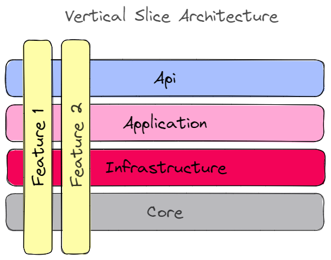

# 🛒 ECommerce-Monolith
<a href="https://github.com/meysamhadeli/ecommerce-monolith/actions/workflows/ci.yml"></a>

> **💡 The primary objective of this project is to establish a framework that can facilitate the deployment and operation of a straightforward ECommerce application using cutting-edge technologies and architecture such as Vertical Slice Architecture, CQRS, and an Anemic Domain Model in .Net.** 🚀

<div>
  <a href='https://codespaces.new/meysamhadeli/ecommerce-monolith?quickstart=1'></a>
</div>

# Table of Contents

- [The Goals of This Project](#the-goals-of-this-project)
- [Technologies - Libraries](#technologies---libraries)
- [Structure of Project](#structure-of-project)
- [Development Setup](#development-setup)
  - [Dotnet Tools Packages](#dotnet-tools-packages)
- [How to Run](#how-to-run)
  - [Docker Compose](#docker-compose)
  - [Documentation Apis](#documentation-apis)

## The Goals of This Project

- :sparkle: Implementing `Vertical Slice Architecture` at the architecture level to create a `scalable` and `maintainable` structure for the application.
- :sparkle: Using an `Anemic Domain Model` with `POCO` entities and pushing `business processes` and `validation rules` into the `handlers` for simplicity.
- :sparkle: Adopting `CQRS` implementation with the `MediatR` library for better separation of `write` and `read` operations.
- :sparkle: Reusing shared building blocks from the [`Griffin`](https://github.com/meysamhadeli/Griffin) repository as a `git submodule` under `src/BuildingBlocks`.
- :sparkle: Implementing `MediatR` to `reduce coupling` and provide support for managing `cross-cutting concerns` within `pipelines`, including `validation` and `transaction handling` for the application.
- :sparkle: Using `Postgres` as our `relational database` management system at the database level.
- :sparkle: Incorporating `Unit Testing`, `Integration Testing`, and `End To End Testing` for testing level to ensure the `robustness` and `reliability` of the application.
- :sparkle: Utilizing `Fluent Validation` and a `Validation Pipeline Behaviour` on top of `MediatR` to validate requests and responses and ensure `data integrity`.
- :sparkle: Using `Minimal API` for all endpoints to create a `lightweight` and `streamlined` API.
- :sparkle: Using `AspNetCore OpenApi` for `generating` built-in support `OpenAPI documentation` in ASP.NET Core.
- :sparkle: Using `Docker-Compose` for our `deployment` mechanism to enable easy deployment and scaling of the application.

## Technologies - Libraries

- ✔️ **[`.NET 10`](https://github.com/dotnet/aspnetcore)** - .NET Framework and .NET Core, including ASP.NET and ASP.NET Core.
- ✔️ **[`MVC Versioning API`](https://github.com/microsoft/aspnet-api-versioning)** - Set of libraries which add service API versioning to ASP.NET Web API, OData with ASP.NET Web API, and ASP.NET Core.
- ✔️ **[`EF Core`](https://github.com/dotnet/efcore)** - Modern object-database mapper for .NET. It supports LINQ queries, change tracking, updates, and schema migrations.
- ✔️ **[`AspNetCore OpenApi`](https://learn.microsoft.com/en-us/aspnet/core/fundamentals/openapi/aspnetcore-openapi?view=aspnetcore-9.0&tabs=visual-studio#configure-openapi-document-generation)** - Provides built-in support for OpenAPI document generation in ASP.NET Core.
- ✔️ **[`MediatR`](https://github.com/jbogard/MediatR)** - Simple, unambitious mediator implementation in .NET.
- ✔️ **[`FluentValidation`](https://github.com/FluentValidation/FluentValidation)** - Popular .NET validation library for building strongly-typed validation rules.
- ✔️ **[`Swagger & Swagger UI`](https://github.com/domaindrivendev/Swashbuckle.AspNetCore)** - Swagger tools for documenting API's built on ASP.NET Core.
- ✔️ **[`Scrutor`](https://github.com/khellang/Scrutor)** - Assembly scanning and decoration extensions for Microsoft.Extensions.DependencyInjection.
- ✔️ **[`AutoMapper`](https://github.com/AutoMapper/AutoMapper)** - Convention-based object-object mapper in .NET.
- ✔️ **[`NewId`](https://github.com/phatboyg/NewId)** - NewId can be used as an embedded unique ID generator that produces 128 bit (16 bytes) sequential IDs.
- ✔️ **[`Sieve`](https://github.com/Biarity/Sieve)** - Sieve is a framework for .NET Core that adds sorting, filtering, and pagination functionality out of the box.
- ✔️ **[`xUnit.net`](https://github.com/xunit/xunit)** - A free, open source, community-focused unit testing tool for the .NET Framework.
- ✔️ **[`Respawn`](https://github.com/jbogard/Respawn)** - Respawn is a small utility to help in resetting test databases to a clean state.
- ✔️ **[`Testcontainers`](https://github.com/testcontainers/testcontainers-dotnet)** - Testcontainers for .NET is a library to support tests with throwaway instances of Docker containers.
- ✔️ **[`Bogus`](https://github.com/bchavez/Bogus)** - Bogus is a simple fake data generator for .NET.

## Structure of Project

In this project I used [vertical slice architecture](https://jimmybogard.com/vertical-slice-architecture/) and [feature folder structure](http://www.kamilgrzybek.com/design/feature-folders/) to structure my files.

To `reduce coupling` in our code, we leverage `Mediatr` and `build pipelines` on top of it to handle `validation`, `logging`, and `transactions`. Our `domain` follows an `Anemic Domain Model`: entities are plain `POCO`s that hold only `state`, while all `business logic` and `validation rules` live in the `command handlers`. This keeps the model simple and moves behavior close to the use case that needs it.

I `treat each request` as a `distinct` use case or `slice`, `encapsulating` and `grouping` `all concerns` from front-end to back with `vertical slice architecture`.
In traditional approach like `clean architecture`, When `adding` or `changing` a feature in an application in n-tire architecture, we are typically `touching many layers` in an application. We are changing the user interface, adding fields to models, modifying validation, and so on. Instead of `coupling across` a layer in traditional architecture, we `couple vertically along a slice`. We `minimize coupling` `between slices`, and `maximize coupling` `in a slice`.

With this approach, each of our `vertical slices` can `decide for itself` how to best fulfill the request. New features only add code, we're not changing shared code and worrying about side effects.

<div align="center">
  
</div>

In traditional ASP.net controllers, related action methods are usually grouped in one controller. However, in my recent project, I opted to use the [REPR pattern](https://deviq.com/design-patterns/repr-design-pattern) (Route-Endpoint-Presenter-Resource) design pattern instead. With this pattern, each action is given its own small endpoint, consisting of a route, the action, and an `IMediator` instance (see [MediatR](https://github.com/jbogard/MediatR)), which is handled by a request-specific IRequestHandler to perform business logic before returning the result. This approach not only `separates` the action `logic` into `individual handlers`, but it also supports the `Single Responsibility`, `Open Close Principle` and `Don't Repeat Yourself` principles, resulting in `clean` and `thin controllers`.

To achieve better separation of concerns and cross-cutting concerns, I used the [Mediator pattern](https://dotnetcoretutorials.com/2019/04/30/the-mediator-pattern-in-net-core-part-1-whats-a-mediator/) in combination with `CQRS` (Command Query Responsibility Segregation) to `decompose features` into `small`, `vertical slices`. `Each slice` has a `group of classes specific to that feature`, including `command`, `handlers`, `infrastructure`, `repository`, and `controllers`. By grouping them together, we can easily maximize `performance`, `scalability`, and `simplicity`, as well as maintain and add features without creating breaking changes or side effects.

With `CQRS`, we can `reduce coupling` between layers and tune down specific methods to not follow general conventions. This is achieved by `cutting each business functionality into vertical slices`, where each command/query handler is a separate slice. As a result, each handler can be a `separate code unit`, even copy/pasted, allowing us to customize individual methods as needed. In contrast, in a `traditional layered` architecture, `changing the core generic mechanism` in `one layer` can `impact all methods`, which can be `time-consuming` and `challenging` to `maintain`.

Overall, by using the `REPR` pattern and `CQRS` with the `Mediator` pattern, we can create a `better-structured` and more `maintainable` application, with improved `separation of concerns`.

## Development Setup

### Clone the Repository

This repository uses the [`Griffin`](https://github.com/meysamhadeli/Griffin) building blocks as a `git submodule` at `src/BuildingBlocks`, so clone it with submodules:

```bash
git clone --recurse-submodules https://github.com/meysamhadeli/ecommerce-monolith.git
```

If you already cloned without submodules, initialize them with:
```bash
git submodule update --init --recursive
```

### Dotnet Tools Packages
For installing our requirement package with .NET cli tools, we need to install `dotnet tool manifest`.
```bash
dotnet new tool-manifest
```
And after that we can restore our dotnet tools packages with .NET cli tools from `.config` folder and `dotnet-tools.json` file.
```
dotnet tool restore
```

## How to Run

### Docker Compose

Run this app in docker using the [docker-compose.yml](./deployments/docker-compose/docker-compose.yml) file with the below command at the `root` of the application:

```bash
docker-compose -f ./deployments/docker-compose/docker-compose.yml up -d
```

> ### Documentation Apis

Each microservice provides `API documentation` and navigate to `/swagger` for `Swagger OpenAPI` or `/scalar/v1` for `Scalar OpenAPI` to visit list of endpoints.

# Support

If you like my work, feel free to:

- ⭐ this repository. And we will be happy together :)

Thanks a bunch for supporting me!

## Contribution

Thanks to all [contributors](https://github.com/meysamhadeli/ecommerce-monolith/graphs/contributors), you're awesome and this wouldn't be possible without you! The goal is to build a categorized, community-driven collection of very well-known resources.

Please follow this [contribution guideline](./CONTRIBUTION.md) to submit a pull request or create the issue.

## License
This project is made available under the MIT license. See [LICENSE](https://github.com/meysamhadeli/ecommerce-monolith/blob/main/LICENSE) for details.
